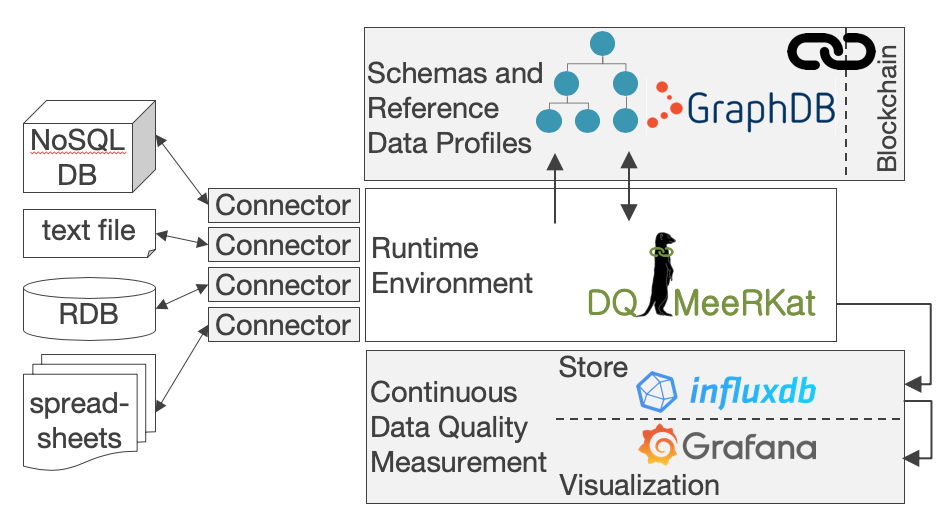

# DQ-MeeRKat

Automating Data Quality Measurement with a Reference-Data-Profile-Annotated Knowledge Graph. In a reference to pop
culture (<a href="https://www.imdb.com/title/tt1853728/" target="_blank">Tarantino: Django Unchained (2012)</a>),
the *t* is silent. DQ-MeeRKat implements a novel method for automated and continuous data quality measurement (CDQM),
which is based on the creation of _reference data profiles_.
The following image illustrates the overall architecture of DQ-MeeRKat. Setup/installation instructions for each
component are described in the following paragraphs.



# History

DQ-MeeRKat is a research project initiated by Johannes Kepler
University (<a href="https://www.jku.at/en/institute-for-application-oriented-knowledge-processing" target="_blank">
JKU</a>) Linz and Software Competence Center Hagenberg (<a href="https://scch.at/en/news" target="_blank">SCCH</a>).
Founded in July, 2019, back then under the title "BlocK-DaQ", its original purpose was to (1) research further on DQ
measurement with the help of Reference Data Profiles (RDPs) and (2) storage in a Knowledge Graph and (3) on the trust
aspect by ensuring authenticity of the RDPs with Blockchains.
Therefore, the title BlocK-DaQ (Blockchain-based Knowledge Graph for Data Quality Measurement using Reference data
profiles) was born.

However, during research one of our main findings was the redundancy of the Blockchain-aspect for the specific use case
of this project, shifting the focus of the implementation more onto the side of the first two topics, with (3) as an
optional addition. Thus outsourcing research on problems with the Blockchain aspect into a different
sub-project, pursued on a different date. Similar to
the "<a href="http://hca.gilead.org.il/ugly_duc.html" target="_blank">ugly duckling</a>" (H.C. Andersen, 1844), our DaQ
had to undergo a transformation from the ugly "BlocK-DaQ" ... to a beautiful DQ-MeeRKat. The main reason for a meerkat
instead of a swan has something to do with the behaviour of the real animal. Since meerkats are alarm callers (standing
on high ground and calling the others in case of an attacking predator,
see <a href="https://doi.org/10.1111/j.1439-0310.1984.tb00101.x" target="_blank"> here</a>),
similarities to our project, whose goal is to create an extensive alarm and crisis management system for observed
systems, preferably with machine learning (ML) support, are present.

## Disclaimer

The provided frameworks and commandline scripts are tested for Windows 10 64bit, earlier versions were also tested for
Linux Mint 19.2 (Tina).

We also provide a development environment based on docker, which is configured in the corresponding `docker-compose.yml`

## Getting Started

DQ-MeeRKat is a Java maven project and in order to build the sources you need the following requirements:

1. Java JDK 1.8 or higher
1. Maven 3.1.0
1. GIT

Afterwards, in order to execute the program, you need to start InfluxDB and Grafana.

Run on Windows:  
`startWinEnv.bat` (for starting InfluxDB and Grafana in one script)

Windows users as well as Linux users can also start the executables provided in the following sections manually, or use
the provided docker environment with the following command:

```shell
docker compose up -d
```

### LEDC-PI

DQ-MeeRKat uses [LEDC-PI](https://gitlab.com/ledc/ledc-pi) for encoding domain knowledge in form of (G)RegEx.
It is defined as a dependency in maven, but the remote repository is not accessible (as of right now). Hence, it is
necessary to clone and install both [LEDC-PI](https://gitlab.com/ledc/ledc-pi)
and [LEDC-Core](https://gitlab.com/ledc/ledc-core) in the local .m2 repository. Simply clone the repositories and
run `mvn clean install` in the root directory of each project.

### InfluxDB

A common choice for storing CDQM results are time-series DBs like InfluxDB, which provides a Java API. DQ-MeeRKat does
not offer an embedded mode (like Derby or GraphDB), but runs InfluxDB outside the Java runtime to persist CDQM results
over time. Furthermore, DQ-MeeRKat also supports both versions of InfluxDB, the legacy 1.8 version and the current
versions >2.0. The docker environment provides the current version of influxdb, while the provided scripts contain the
legacy version of influxdb.

Run on Linux:  
```InfluxDB\startInflux.sh``` (for starting InfluxDB server)    
```InfluxDB\startInfluxConsole.sh``` (for querying InfluxDB using the console)

Run on Windows:  
```InfluxDB\influxdb-1.8.5-1_windows\influxd.exe```

Run using docker:

```shell
docker compose up -d influxdb
```

#### Docker Setup

After starting the docker containers some configuration is necessary. The main difference between the current and the
legacy version is the handling of authorisation towards the database. Currently, authorisation uses tokens from
the database, that are sometimes regenerated each time the database initializes, i.E. when the container is created.
Note the difference between __created__ and __started__! Each time the container of the influx is created a new
organisation token is generated. It is persistent throughout restarts, only during recreation it is regenerated.

This organisation token, as well as the user token, which is found in the `docker-compose.yml` need to be provided to
the java environment by a `influx.properties` file in the resource folder. The file is ignored by git to avoid merge
conflicts.

InfluxDB also provides a web ui, accessible on port 8086. The login credentials can be extracted from the
`docker-compose.yml`. All tokens can be found in the _About_ section, when clicking on the admin icon.

### Grafana

<a href="https://grafana.com" target="_blank">Grafana</a> is a browser-based dashboard for visualization. After the
start, a browser window is opened with the dashboard URL (http://localhost:3000 by default).

Run on Linux:  
```Grafana\startGrafana.sh```

Run on Windows:   
```Grafana\grafana-7.5.5_windows\bin\grafana-server.exe```

Run using docker:

```shell
docker compose up -d grafana
```

Configure Grafana to execute demos:

- Provide password for user
- Configuration - Data Sources - Add data source - InfluxDB
    - URL: http://localhost:8086
    - Basic Auth: add credentials
    - Database: "testSeries"
- Import Demo Dashboards from GitHub directory:
    - Import - Upload .json File:
      ```Grafana\Dashboard-Exports\*-dashboard.json```

### Neo4J

Neo4J can be either run inside the docker environment using the `docker-compose.yml`, or locally. For the latter,
download any version __>3.5__ from the [neo4j website](https://neo4j.com/labs/apoc/4.0/installation/#neo4j-desktop)
and follow the installation instructions. Then, create a project and database in Neo4j Desktop.
Install the APOC library, ensure the database itself does not run and follow these steps:

1. Hover over Database which need to intall APOC
2. Click on the blue button "Open"
3. Select tab "Plugins"
4. Expand APOC
5. Click Install

After starting the database, DQ-MeeRKat should be able to connect to it.

Alternatively, the docker-compose already has a setup defined for neo4j 4.1.x, including apoc installation and database
generation. `docker compose up -d neo4j` starts the service. Data and plugins of this instance are stored in
`neo4j/`.   
After a short startup period the webinterface should be accessible at `localhost:7474` and DQ-MeeRKat can access it
accordingly.

### Pentaho Data Integration

DQ-MeeRKat also enables the possibility to use the generation of RDPs
in <a href="https://www.hitachivantara.com/en-us/products/data-management-analytics/pentaho.html" target="_blank">
Pentaho Data Integration (PDI) by Hitachi Vantara</a>. DQ-MeeRKat is tested and developed for compatibility of PDI 9.0,
found <a href="https://sourceforge.net/projects/pentaho/files/Pentaho%209.0/client-tools/" target="_blank">here</a>. For
usage in PDI, the Project has to be exported as a JAR archive (In Eclipse: Export => Export => Jar file). Surrounding
folders can be excluded, since only the src folder matters. For correct inclusion the following steps have to be done:

- Creation of folder "DQ-MeeRKat" in <Path-to-Pentaho>\data-integration\plugins
- Place JAR in there
- Create subfolders: \output and \patterns
- Place file for pattern recognition called *.in into the \patterns subfolder

### Configuration

DQ-MeeRKat is configured using a json config file. There is an example in the resource folder called `dqConfig.json`.
It defines what DataQualityMeasures are used and how they are configured. Each json object defines a Data Quality
Profile template, which is a set of Data Quality Measures. The sum of the Data Quality Measures defines the overall
Data Quality Profile. The example `dqConfig.json` shown below defines the following Data Quality Profiles:

```json
[
  {
    "type": "ledcpi",
    "ledcPiId": "at.fh.scch/identifier#humidity:*",
    "ledcPiFilePath": "src/main/resource/data/ledc-pi_definitions.json"
  },
  {
    "type": "full"
  }
]
```

* One LEDC-PI Pattern recognition measure, which needs the ledcpi property id and a path to the ledc-pi definition
* One "_full_" Data Quality Profile, containing a set of predefined data quality metrics, such as Number of Rows, Min,
  Max, etc.

The `type` defined in the config corresponds to a DataProfileSkeletonBuilder implementation. Each such implementation
deserializes the config and tries to create a DataProfileSkeleton out of it, using custom generators. In theory, each
type should correspond to one DataProfileSkeletonBuilder implementation. This allows dynamic creation of data profile
metrics and easy extension of the data profile config mechanism.

# Blockchain aspect

To generate tamper-free persistance of stored data a blockchain is used. Creating blockchains in Java is a difficult
task since Reflections exist (more in section Persistance),
so a pseudo-temper-free (therefore only temper-evident) chain is the nearest result is what can be achieved.

## Hashing Algorithms

Used in BigChainDB and generally a widespread approach:

- Standard Hash: SHA3-256
- Keypair Hash: Ed25519 (Encoded via Base58)

## Microchains

Microchains are a further approach to improve performance of blockchains. Since DSDElements are seperated objects, they
can be seperated into several miniature versions of blockchains, one for each DSDElement.
As shown in the tests in the package *demos.alex.benchmarking*, these chains are slightly better in adding and
creating (about 9-15 %) and significantly better for accessing data (about 75 %).
Each chain contains a blockchain for the element, adapted with an identifier for the minichain and flags used for
merging and deletion control.

# Persistence

To persist changes in the chain and also generate a graph out of it, multiple storing methods are used. These are:

- GraphDB (for storing the RDF based graphs)
- InfluxDB to store records and the values from the data profiles

## GraphDB

GraphDB by ontotext is a software which can be downloaded and installed in its standalone form
from http://graphdb.ontotext.com/. This method of storing knowledge graphs was mainly chosen because it supports rdf
stores
and is usable via Java in an embedded mode. To store concrete Java objects in GraphDB, they have to be mapped to RDF
format. Since Java does not naturally support such a mapping toolbox, an external library has to be chosen.
An aspect, which cannot be forgotten is the connection between Java and GraphDB. The embedded version mainly uses RDF4j
as API.

Run on Windows:    
```GraphDB\ GraphDB_Free-9.0.0.exe```

Open GraphDB Server and Workbench in browser:     
```http://localhost:7200/```

Quick start guide for further usage: http://graphdb.ontotext.com/free/quick-start-guide.html

Open Demo Dashboard in GraphDB

- Setup - Create new repository
- Repository ID: DQM
- Repository title: DQ-MeeRKat-repo
- Storage folder: <local-path-to-repo>\kg-repo\repositories\kg-repo\storage
- Leave default settings for remaining options
  Restart GraphDB and explore graph via Explore - Graphs overview.

## Mapping Java objects to RDF

Three choices for mapping libraries were possible, namely:

- Jackson (converts objects to JSON from which conversion is possible, not used because cyclic references could not be
  handled)
- Pinto (not used, because is was not supported anymore and more extensive frameworks like Empire are not needed)
- RDFBeans (annotation-based mapping from Java to RDF)

### RDFBeans

RDFBeans (https://rdfbeans.github.io/) is a library, which allows a developer to annotate java classes and fields to
generate RDF triples from them. It also supports mapping back from RDF to Java objects as well, which is one of the main
reasons why it was chosen instead of the other two libraries. There are mainly four annotations used in this project:

- @RDFNamespaces (used above the class to define namespaces)
- @RDFBean (signalizes that the class is transformable into a RDF format)
- @RDFSubject (used above the getter of the id of this object to easily retrieve it)
- @RDF (used above the getters of all other fields to mark them for transformation)

# Useful links

## API

* [docker-compose reference](https://docs.docker.com/compose/compose-file/)
* GraphDB Quick Start Guide: http://graphdb.ontotext.com/documentation/free/quick-start-guide.html
* InfluxDB: https://docs.influxdata.com/influxdb/v1.7/
* InfluxDB-Java: https://github.com/influxdata/influxdb-java
* InfluxDB: https://www.baeldung.com/java-influxdb
* Grafana Docs: https://grafana.com/docs/
* RDFBeans: https://rdfbeans.github.io/
* RDF4j: https://rdf4j.eclipse.org/
* QuaIIe (usage of connectors): http://dqm.faw.jku.at/
* Pentaho Javadoc (Plugin Development): https://javadoc.pentaho.com/kettle900/kettle-core-9.0.0.1-426-javadoc/index.html

# Used libraries

* ELKI: https://github.com/elki-project/elki   used Algorithm: Local Outlier
  Factor: https://doi.org/10.1145/335191.335388
